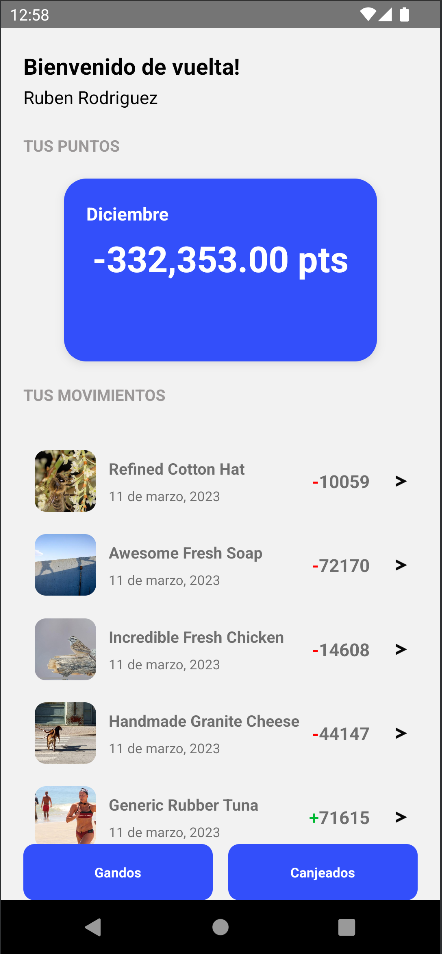
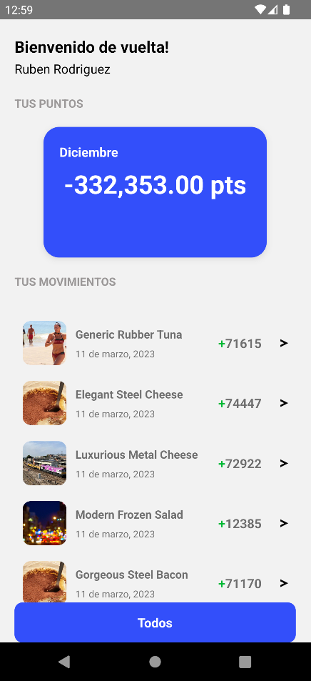
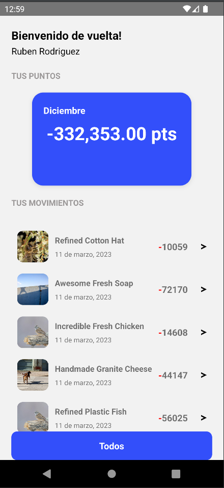
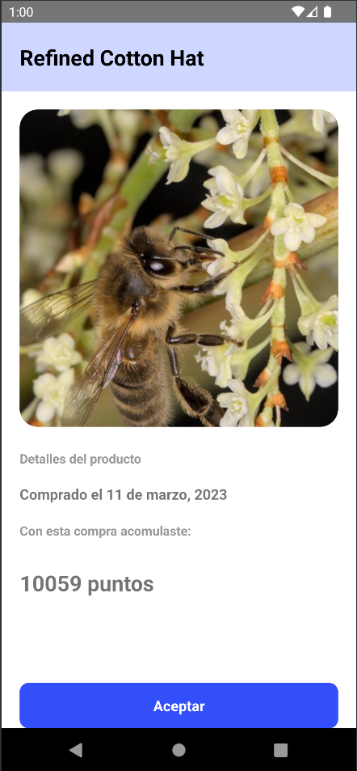
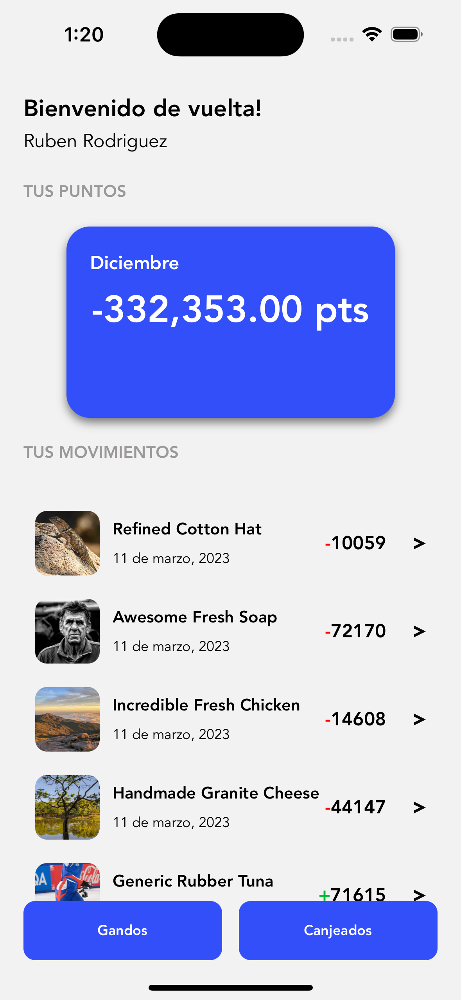
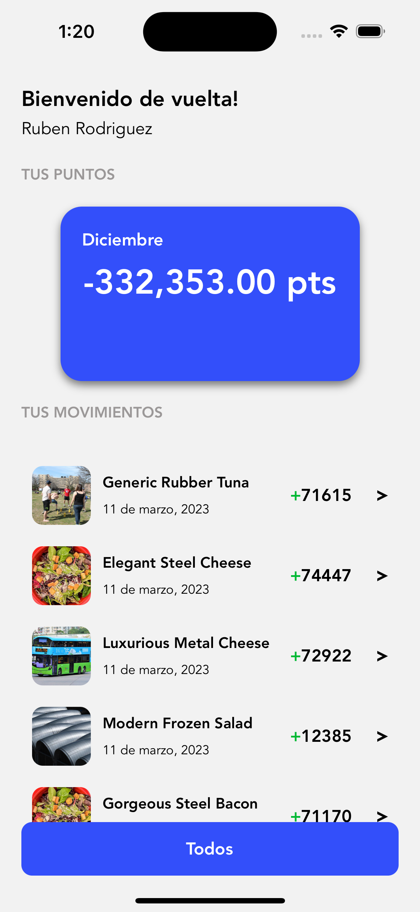
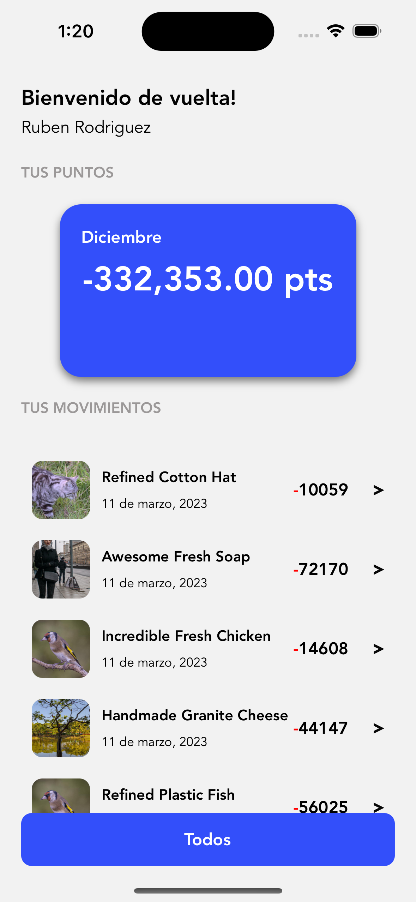
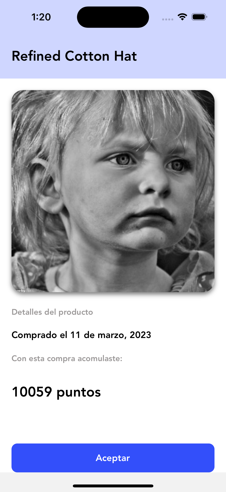

# Wallet

Hola, desarrolle este proyecto con la finalidad de demostrar mi habilidad en la creación de aplicaciones con React Native.

## pantallas de Android

|                   Android 1                    |                   Android 2                    |
| :--------------------------------------------: | :--------------------------------------------: |
|  |  |
|                   Android 2                    |                   Android 3                    |
| :--------------------------------------------: | :--------------------------------------------: |
|  |  |

## pantallas de iOS

|                     iOS 1                      |                     iOS 2                      |
| :--------------------------------------------: | :--------------------------------------------: |
|      |      |
|                     iOS 2                      |                     iOS 3                      |
| :--------------------------------------------: | :--------------------------------------------: |
|      |      |

## Estructura de documentos

Uso de Atomic Design por Brad Frost, considero que es una estructura excelente para trabajar por componentes. Da mucha facilidad para hacer componentes dummy con 0 dependencia a data.

## Test

Se logró hacer Unit Test y Test de integración
